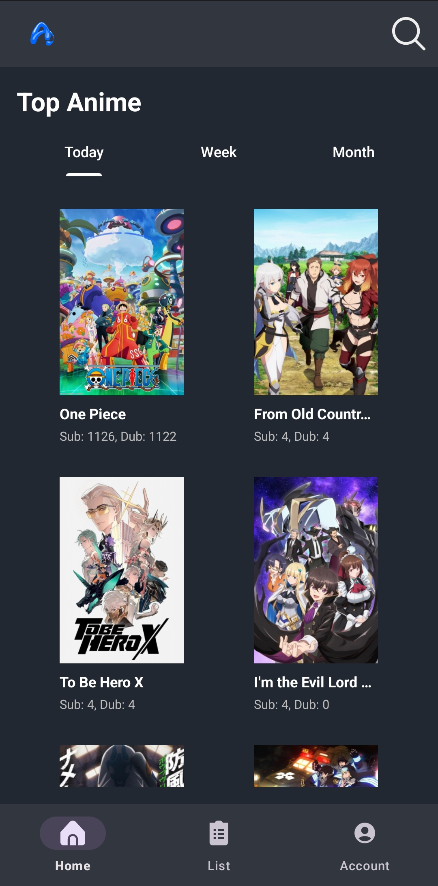
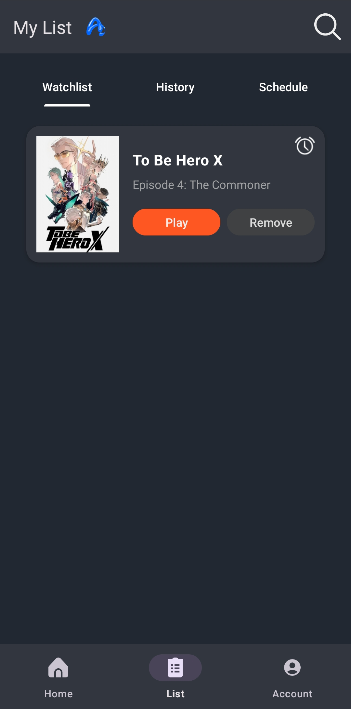

# 📱 AniWatch - Your Anime Companion App

AniWatch is a feature-rich mobile application designed to enhance your anime-watching experience. With a sleek and user-friendly interface, AniWatch provides tools to explore episodes and customize your preferences. Whether you're a casual viewer or a dedicated fan, AniWatch is here to make your anime journey seamless and enjoyable.

---

## 🌟 Features

### 📅 **Schedule Feature**
- View anime schedules by date selection
- Keep track of upcoming episodes for your favorite series
- Integrated into the main app navigation

### ⏰ **Reminder System**
- Set reminders for watchlist episodes
- Intelligent alarm scheduling for your favorite shows
- Never miss an episode with customizable notifications

### 🔄 **Shimmer Loading Effect**
- Enjoy a visually appealing shimmer effect while content is loading
- Skeleton views for episode lists during data fetch
- Smooth and responsive UI for a better user experience

### 🔔 **Notification Management**
- Enable or disable notifications based on your preferences
- Customize how and when you receive alerts
- Stay updated on your terms

### 🗂 **RecyclerView Integration**
- Browse through your anime episodes in a scrollable list
- Optimized for performance and usability

### 🔒 **Security Settings**
- Enable or disable the "Remember Me" feature for login credentials
- Easily change your password for enhanced security

### 📋 **Watchlist & History**
- Keep track of episodes you want to watch
- Review your viewing history
- Dynamic management of watchlist and history states

---

## 🛠️ **Tech Stack**

- **Languages**: Kotlin, Java
- **Frameworks**: Android SDK
- **Build Tool**: Gradle
- **UI Components**: RecyclerView, ShimmerFrameLayout, AlertDialog, CoordinatorLayout

---

## 📂 **Project Structure**

- **Activities**: Handles user interactions and navigation
- **Fragments**: Modular UI components for different app sections
- **Adapters**: Custom adapters for managing list views
- **Data Models**: Represents the structure of anime episodes
- **Helpers**: Utility classes for improved code organization

---

## 🚀 **How to Run**

1. Clone the repository:
   ```bash
   git clone https://github.com/jonvicbarcenas/MobileDevelopment.git
   ```
2. Open the project in Android Studio.
3. Sync Gradle and resolve dependencies.
4. Run the app on an emulator or a physical device.

---

## 📸 **Screenshots**

| Home Screen | Watchlist Settings                 |
|-------------|------------------------------------|
|  |  |

---

## ⚠️ **Disclaimer**

AniWatch is developed solely for educational purposes and is intended to serve as a learning tool for exploring concepts such as API communication, integration, and mobile application development. The app demonstrates how to interact with APIs, manage data, and implement various Android features like RecyclerView, custom adapters, and user interface components.

We emphasize that AniWatch does not host, stream, or distribute any copyrighted content. The app does not provide access to any illegal or unauthorized sources of anime or other media. All content displayed within the app is either user-provided or simulated for demonstration purposes.

By using AniWatch, users agree to take full responsibility for ensuring compliance with copyright laws and regulations in their respective regions. The developers of AniWatch do not condone or support piracy in any form. This project is strictly for educational exploration and should not be used for any activities that violate intellectual property rights.

If you have any concerns or questions regarding the app's functionality or purpose, please feel free to reach out to us through the contact information provided below.

---

## 📧 **Contact**

- Email: jonvicbarcenas1@gmail.com
- GitHub: [Jonvicbarcenas](https://github.com/jonvicbarcenas), [Leana](https://github.com/leanamariflor)

---

## ❤️ Thank You for Using AniWatch!